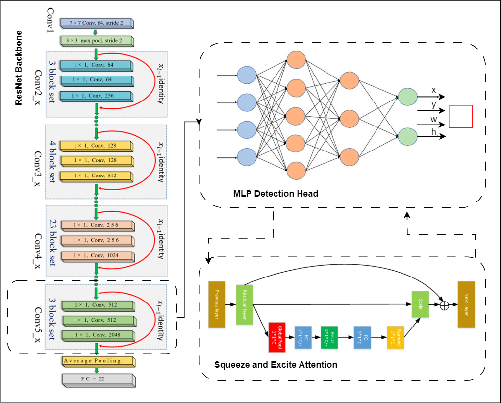
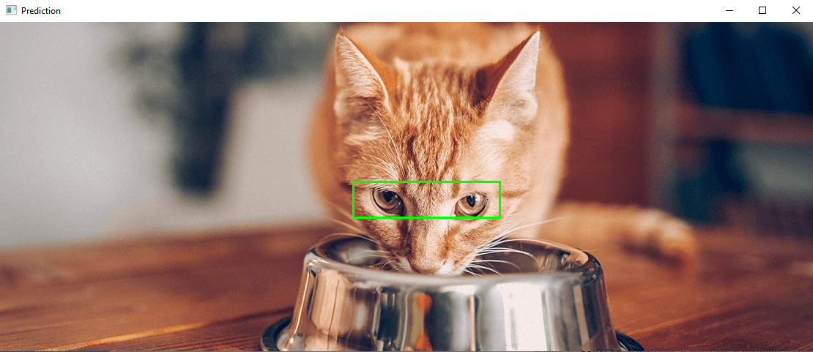

# 🧠 Simple Bounding Box Detector (Single-Object Detection)

This project demonstrates how to build a **lightweight object detection model** using PyTorch.
It focuses on **single bounding box prediction per image** — perfect for learning the core
ideas behind object detection **without the complexity of anchor boxes, multi-class classification, or heavy post-processing.**

For demonstration purposes, I used a custom dataset containing **single-object images**. The model directly **predicts bounding box coordinates** — with **no class predictions** involved.

The dataset features **cat images**, and the **task** is to **detect** the **eye region** of each cat.

I conducted several experiments using different **backbones**, **loss functions**, and **hyperparameters**. While they weren't exhaustive, they were sufficient to demonstrate the core ideas behind bounding box regression:
- Among all configurations, **ResNet34** combined with **SmoothL1** Loss consistently delivered solid results.
- I also use **transfer learning** to fine-tune the backbone on the bounding box regression task.
- **Augmentation** techniques such as flips, color jittering, and rotations helped improve the model's generalization given the small data size.
- Additionally, I integrated **Squeeze-and-Excitation (SE) attention** into the regression head and found it to help boost the **IoU** performance by approximately **2–3%**.

<div align="center">
  
</div>


---

## 📦 Project Structure

```
project-root/
├── data/
│   ├── train/
│   │   ├── images/
│   │   └── labels/
│   └── valid/
│       ├── images/
│       └── labels/
├── train.py
├── trainer.py
├── bbox_dataset.py
├── config.py
├── models.py
├── loss.py
├── eval.py
├── predict.py
├── augment.py
├── checkpoints/
└── README.md
```

---

## 📁 Dataset Format

- For conveniance, I attached a **sample dataset** with **images** and **labels** (fine in `data/`).
- **Training** and **Test** data are in `data/train/` and `data/test/`.
- **Images** go in `images/` folders.
- **Labels** are in `labels/`, one `.txt` per image.
- Each label contains a **single normalized bounding box**:  
  Format: `x1 y1 x2 y2` → values in range `[0, 1]`

**Example (`image123.txt`):**
```
0.15 0.22 0.65 0.74
```

---

## 🛠️ Setup

### 🐍 Create a Conda environment:
```bash
conda create -n bboxnet python=3.9 -y
conda activate bboxnet
```

### 📦 Install dependencies:
```bash
pip install torch torchvision opencv-python matplotlib
```

---

### 📚 Configuration

You can adjust hyperparameters in `config.py`:
- `backbone`: Choose from `"resnet34"`, `"mobilenet_v2"`, `"shufflenet"`, `"efficientnet_b0"`
- `loss_fn`: Choose from: `"mse"`, `"smoothl1"`, `"L1Loss"`, `"WingLoss"`, `"iou"`, `"giou"`, `"ciou"`

```python
class Config:
    def __init__(self):
        self.image_size = (224, 224)
        self.lr = 1e-5
        self.use_scheduler = False
        self.loss_fn = "smoothl1"  # "iou", "giou", "ciou", "mse", "smoothl1", "WingLoss", "L1Loss"
        self.batch_size = 16
        self.shuffle = True
        self.epochs = 200
        self.backbone = "resnet34"  # "resnet34", "mobilenet_v2", "shufflenet", "efficientnet_b0"
        self.freeze_backbone = False
        self.eval_every = 4
        self.train_images = './data/train/images'
        self.train_labels = './data/train/labels'
        self.test_images = './data/test/images'
        self.test_labels = './data/test/labels'
        self.checkpoints_dir = "checkpoints"
        self.hflip = True
        self.vflip = True
        self.rotate = True
        self.color_jitter = True
        self.grayscale = False
        self.blur = False
        self.sharpness = False

```

## 🚀 Training

Run the training script:

```bash
python train.py
```

Checkpoints are saved automatically to `checkpoints/`.

---

## 🧪 Evaluation

Evaluation uses **IoU (Intersection over Union)** between predicted and true bounding boxes.  
Runs every few epochs (controlled by `eval_every`).

---

## 📡 Inference

Use `predict.py` to visualize predictions:

```bash
python predict.py
```

It resizes images, feeds them to the model, and draws predicted boxes back on the **original image size**.

---

## 🧱 Model Architecture

You can choose between:

### ✅ FC-based model:
```
Backbone (e.g. "resnet18/34/50", "mobilenet_v2", "shufflenet", "efficientnet_b0") → Flatten → Linear(256) → Linear(4) → Sigmoid
```

### ✅ Conv-based head:
```
Backbone (ResNet18 conv layers) → Conv → AvgPool → Conv(4) → Sigmoid (implemented in models.py)
```

Both output `[x1, y1, x2, y2]` normalized bbox values.

---

## Results

```python
Epoch 192/400, Loss: 0.0003, Val IoU: 0.6109
✅ Saved best model!
```




## 💬 License / Credits

Feel free to use, share, and learn from this project. Built with love for understanding object detection fundamentals.
